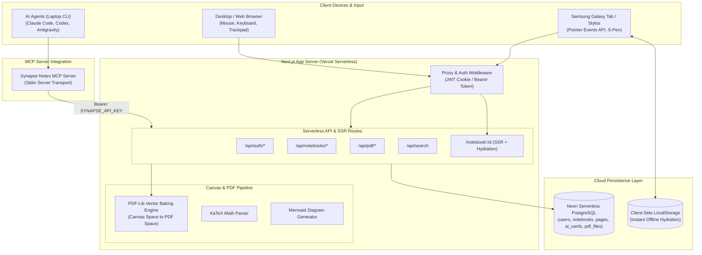
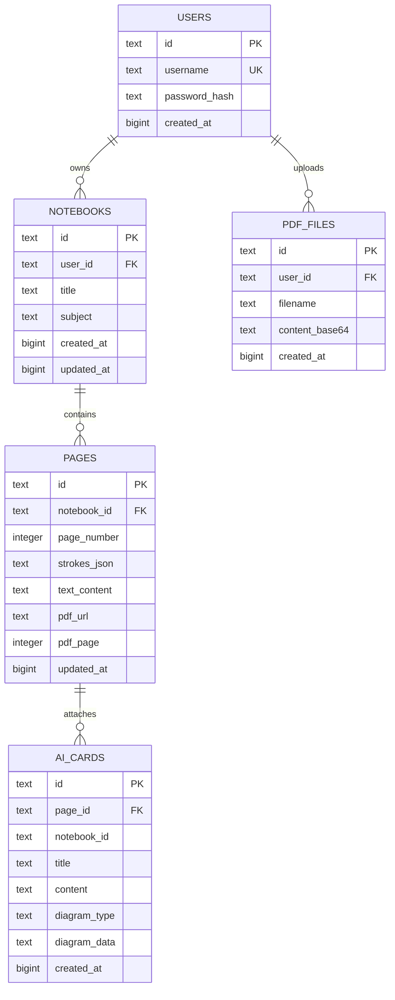
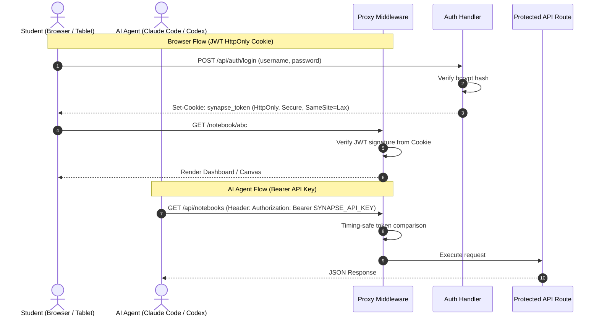

# System Architecture — Synapse Notes

This document specifies the technical architecture, component hierarchy, data models, coordinate transformation pipelines, and security mechanisms for **Synapse Notes**.

---

## 1. System Topology

Synapse Notes follows a single-domain, serverless full-stack architecture powered by Next.js App Router, Neon Serverless PostgreSQL, and a standard Model Context Protocol (MCP) bridge.



---

## 2. Canvas & Stylus Rendering Pipeline

### 2.1. Pointer Events & Hardware Sampling
The canvas uses the W3C Pointer Events API rather than Touch Events. This enables distinguishing between active stylus interaction and accidental palm touch:

```ts
function onPointerDown(e: PointerEvent) {
  // Ignore finger touches when writing with S-Pen
  if (e.pointerType === "touch" && isPenActive) return;
  
  const pressure = e.pressure || 0.5; // Hardware pressure sensitivity (0.0 - 1.0)
  const dynamicSize = tool === "pen" ? baseSize * (0.5 + pressure * 1.5) : baseSize;
  
  // Capture pointer to prevent gesture collisions
  canvasRef.current.setPointerCapture(e.pointerId);
}
```

### 2.2. Stroke Curve Smoothing
To eliminate angular jitter during rapid cursive handwriting, raw points are smoothed on-the-fly using quadratic Bézier curves:

$$\text{Midpoint}_i = \left( \frac{x_i + x_{i+1}}{2}, \frac{y_i + y_{i+1}}{2} \right)$$

```ts
ctx.beginPath();
ctx.moveTo(stroke.points[0].x, stroke.points[0].y);
for (let i = 1; i < stroke.points.length - 1; i++) {
  const mx = (stroke.points[i].x + stroke.points[i + 1].x) / 2;
  const my = (stroke.points[i].y + stroke.points[i + 1].y) / 2;
  ctx.quadraticCurveTo(stroke.points[i].x, stroke.points[i].y, mx, my);
}
ctx.lineTo(lastPoint.x, lastPoint.y);
ctx.stroke();
```

---

## 3. PDF Coordinate Space Transformation & Vector Baking

When annotating PDF lecture slides, the browser canvas space uses a **top-left origin** with arbitrary device pixel density, while PDF documents adhere to a **bottom-left origin** measured in PostScript points ($72\text{ dpi}$).

### Coordinate Mapping Formula

$$\begin{aligned}
\text{scale}_x &= \frac{\text{PageWidth}_{\text{pdf}}}{\text{Width}_{\text{canvas}}} \\
\text{scale}_y &= \frac{\text{PageHeight}_{\text{pdf}}}{\text{Height}_{\text{canvas}}} \\
X_{\text{pdf}} &= X_{\text{canvas}} \times \text{scale}_x \\
Y_{\text{pdf}} &= \text{PageHeight}_{\text{pdf}} - (Y_{\text{canvas}} \times \text{scale}_y)
\end{aligned}$$

```ts
// src/app/api/pdf/export/route.ts
page.drawLine({
  start: {
    x: prev.x * scaleX,
    y: pageHeight - prev.y * scaleY, // Y-axis inverted
  },
  end: {
    x: curr.x * scaleX,
    y: pageHeight - curr.y * scaleY,
  },
  thickness: Math.max(1, stroke.size * Math.min(scaleX, scaleY)),
  color: rgb(r, g, b),
  opacity: stroke.tool === "highlighter" ? 0.4 : 1.0,
  lineCap: LineCapStyle.Round,
});
```

---

## 4. Database Schema Specification (Neon PostgreSQL)



### Table Definitions

#### `users`
| Column | Type | Constraints | Description |
|---|---|---|---|
| `id` | `TEXT` | `PRIMARY KEY` | UUIDv4 string |
| `username` | `TEXT` | `UNIQUE NOT NULL` | Case-insensitive login identifier |
| `password_hash` | `TEXT` | `NOT NULL` | Bcrypt salt rounds (12) |
| `created_at` | `BIGINT` | `NOT NULL` | Unix epoch in seconds |

#### `notebooks`
| Column | Type | Constraints | Description |
|---|---|---|---|
| `id` | `TEXT` | `PRIMARY KEY` | UUIDv4 string |
| `user_id` | `TEXT` | `REFERENCES users(id) ON DELETE CASCADE` | Owner user ID |
| `title` | `TEXT` | `NOT NULL` | Notebook name |
| `subject` | `TEXT` | `DEFAULT ''` | Academic course (e.g. "Deep Learning") |
| `created_at` | `BIGINT` | `NOT NULL` | Timestamp |
| `updated_at` | `BIGINT` | `NOT NULL` | Last modified timestamp |

#### `pages`
| Column | Type | Constraints | Description |
|---|---|---|---|
| `id` | `TEXT` | `PRIMARY KEY` | UUIDv4 string |
| `notebook_id` | `TEXT` | `REFERENCES notebooks(id) ON DELETE CASCADE` | Parent notebook |
| `page_number` | `INTEGER` | `NOT NULL` | 1-based page index |
| `strokes_json` | `TEXT` | `DEFAULT '[]'` | Serialized vector handwriting points |
| `text_content` | `TEXT` | `DEFAULT ''` | Transcribed / typed text notes |
| `pdf_url` | `TEXT` | `NULL` | Underlying PDF slide attachment URL |
| `pdf_page` | `INTEGER` | `NULL` | Attached slide page index |
| `updated_at` | `BIGINT` | `NOT NULL` | Timestamp |

#### `ai_cards`
| Column | Type | Constraints | Description |
|---|---|---|---|
| `id` | `TEXT` | `PRIMARY KEY` | UUIDv4 string |
| `page_id` | `TEXT` | `REFERENCES pages(id) ON DELETE CASCADE` | Associated page |
| `notebook_id` | `TEXT` | `NOT NULL` | Denormalized notebook reference |
| `title` | `TEXT` | `NOT NULL` | Study card headline |
| `content` | `TEXT` | `NOT NULL` | Markdown body with LaTeX math |
| `diagram_type` | `TEXT` | `DEFAULT 'none'` | `none` \| `mermaid` \| `flowchart` |
| `diagram_data` | `TEXT` | `DEFAULT ''` | Mermaid source code string |
| `created_at` | `BIGINT` | `NOT NULL` | Timestamp |

#### `pdf_files`
| Column | Type | Constraints | Description |
|---|---|---|---|
| `id` | `TEXT` | `PRIMARY KEY` | UUIDv4 string |
| `user_id` | `TEXT` | `NOT NULL` | Uploading user ID |
| `filename` | `TEXT` | `NOT NULL` | Original filename |
| `content_base64` | `TEXT` | `NOT NULL` | Base64 encoded binary PDF document |
| `created_at` | `BIGINT` | `NOT NULL` | Timestamp |

---

## 5. Security & Authentication Architecture

Synapse Notes implements a dual-mode authentication scheme:


